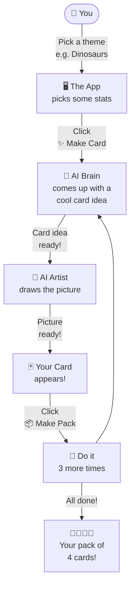
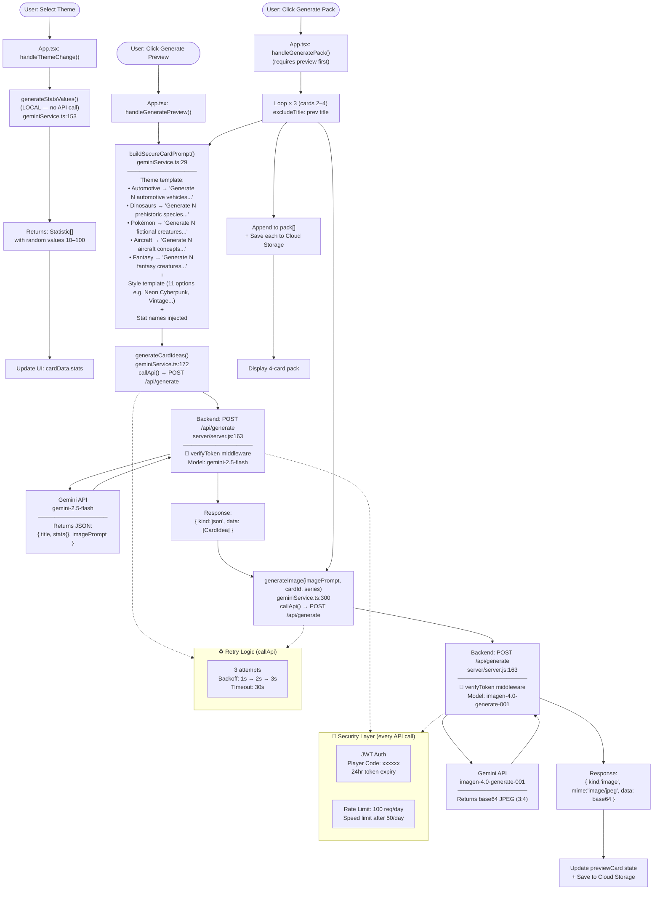
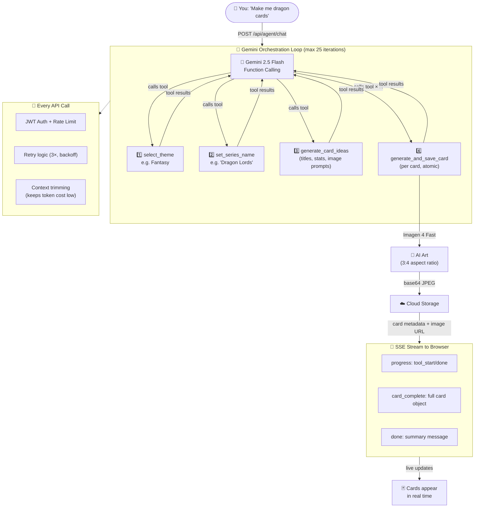

/# 🎯 AI Top Trumps Card Generator

  

A state-of-the-art AI-powered web application that generates professional-quality Top Trumps-style trading cards. Harness the power of Google's Gemini AI to create unique themes, balanced statistics, and stunning artwork for your custom card collections.


> **🔐 Authentication Required**: The application now requires a player code to access all features. This ensures secure usage and prevents unauthorized access to AI services.

## 🗺️ How It Works



[](https://reactjs.org/)
[](https://www.typescriptlang.org/)
[](https://nodejs.org/)
[](https://cloud.google.com/run)
[](https://docker.com/)
[](LICENSE)

## ✨ Features

-   **🔐 Secure Authentication**: Player code-based login system with JWT tokens for secure access control
-   **🎮 Child-Friendly Interface**: Login screen designed specifically for 12-year-old target audience
-   **🛡️ Protected API Access**: All AI endpoints require authentication to prevent unauthorized usage
-   **💾 Session Management**: Persistent login state with automatic token validation
-   **⚡ Rate Limiting**: Global rate limit of 100 requests per day to prevent abuse and control costs
-   **🧠 Agent Mode**: Natural language card generation — just describe what you want ("Make me 3 dragon cards") and the AI autonomously orchestrates the entire pipeline via Gemini function calling with real-time streaming progress.
-   **🤖 AI-Powered Content Generation**: Utilises `gemini-2.5-flash` to dynamically generate thematic statistics and full card packs with unique titles and values.
-   **🎨 Stunning AI Image Generation**: Leverages `imagen-4.0-generate-001` (Imagen 4 Fast) to create high-quality, custom artwork for each card based on dynamic prompts.
-   **👀 Live Interactive Preview**: Instantly see how your card looks with a beautiful initial preview that loads immediately.
-   **🎛️ Deep Customization**:
    -   Choose from a variety of themes (Dinosaurs, Fantasy, Automotive, Aircraft, Pokémon).
    -   Select different color schemes to match your theme.
    -   Apply unique image styles (Holographic, Vintage, Cyberpunk, Realistic, etc.).
-   **📦 Full Pack Generation**: Create a set of 4 unique cards, starting with your customized preview card.
-   **☁️ Cloud Storage Integration**: Persistent storage for generated images and card data via Google Cloud Storage.
-   **⚡ Production Ready**: Deployed on Google Cloud Run with optimized performance and scalability.
-   **📱 Enhanced Mobile Experience**: Responsive design optimized for all devices with native mobile capabilities.
-   **📲 iPhone "Save to Photos"**: Direct integration with iOS Photos app via Web Share API for seamless saving.
-   **🚫 Popup-Free Downloads**: Modern blob-based downloads eliminate browser popup blocking issues.
-   **🔗 Native Sharing**: Web Share API integration provides platform-native sharing experience on supported devices.
-   **🔄 Sequential Generation**: Reliable card-by-card generation for better success rates.

## 🚀 How to Use

1.  **🔐 Login**: Enter your player code to access the application. Contact an admin if you need a player code.
2.  **Customize Basics**: Start by giving your card series a name (e.g., "Mythical Creatures") and a title for your first card (e.g., "Griffin").
3.  **Select a Theme**: Choose a theme from the dropdown. This will automatically generate 6 relevant statistic names using AI.
4.  **Choose a Style**: Select a Color Scheme and an Image Style that best fits your vision.
5.  **Tweak Stats**: Adjust the AI-generated stats or randomize them for fun.
6.  **Generate Preview**: Click "Generate Preview Card". The AI will generate a new title, balanced stats, and a stunning image based on your settings. The live preview will update with the AI-generated result.
7.  **Generate Full Pack**: Once you're happy with the preview card, click "Generate Full Pack". The application will generate 3 more unique cards that match your theme and style.
8.  **View Your Cards**: All generated cards from the pack will be displayed at the bottom for you to admire and use.

## 🛠️ Getting Started

### Prerequisites

- Node.js and npm installed.
- A Google Gemini API key.

### Installation

1. **Clone the repository:**
   ```bash
   git clone https://github.com/your-username/AI-Top-Trumps-Card-Generator.git
   cd AI-Top-Trumps-Card-Generator
   ```

2. **Install frontend dependencies:**
   ```bash
   npm install
   ```

3. **Install backend dependencies:**
   ```bash
   cd server
   npm install
   cd ..
   ```

4. **Set up your environment variables:**
   ```bash
   cp .env.example .env
   ```
   
5. **Edit `.env` with your actual values:**
   - `GEMINI_API_KEY`: Get from [Google AI Studio](https://aistudio.google.com/app/apikey)
   - `STORAGE_BUCKET`: Your Google Cloud Storage bucket name (optional for local dev)
   - `GOOGLE_APPLICATION_CREDENTIALS`: Path to your service account key (optional for local dev)
   - `VITE_GEMINI_API_URL`: Should be `http://localhost:3001/api/generate` for local development

### 🚀 Start the Application

- **Start both the frontend and backend servers concurrently:**
  ```bash
  npm run dev
  ```
- The frontend will be available at `http://localhost:8088` and the backend at `http://localhost:3001`.

## 🚀 Production Deployment

The application is production-ready and deployed on Google Cloud Run.

### Current Production Deployment
- **Platform**: Google Cloud Run (europe-north1)
- **Project**: whispers-of-the-wildwood
- **Auto-scaling**: 0-10 instances based on demand

### Deploy Your Own Instance

1. **Prerequisites:**
   - Google Cloud Project with Cloud Run and Secret Manager APIs enabled
   - Docker and gcloud CLI installed
   - Gemini API key

2. **Production deployment options:**
   
   **Safe production deployment (with confirmations):**
   ```bash
   ./deploy-prod.sh
   ```
   
   **Quick production deployment (no prompts):**
   ```bash
   ./deploy-simple-prod.sh
   ```

3. **UAT deployment options:**
   
   **Full UAT deployment (with detailed logging):**
   ```bash
   ./deploy-uat.sh
   ```
   
   **Quick UAT deployment (streamlined):**
   ```bash
   ./deploy-simple-uat.sh
   ```

## 📋 Deployment Scripts Reference

The project includes four deployment scripts with explicit environment targeting:

| Script | Environment | Purpose | Prompts | Resources |
|--------|-------------|---------|---------|-----------|
| `deploy-prod.sh` | Production | Safe deployment with human-in-the-loop safeguards | ✅ Yes | 2Gi RAM, 2 CPU |
| `deploy-simple-prod.sh` | Production | Quick deployment for CI/CD pipelines | ❌ No | 2Gi RAM, 2 CPU |
| `deploy-uat.sh` | UAT | Full UAT deployment with detailed logging | ✅ Yes | 1Gi RAM, 1 CPU |
| `deploy-simple-uat.sh` | UAT | Streamlined UAT deployment | ❌ No | 1Gi RAM, 1 CPU |

**Environment Mapping:**
- **Production**: Service `ai-top-trumps-card-generator` with bucket `cards_storage-whispers-of-the-wildwood`
- **UAT**: Service `ai-top-trumps-card-generator-uat` with bucket `cards_storage-uat-whispers-of-the-wildwood`

The deployment scripts handle:
- Container building and registry push
- Secret management via Google Secret Manager  
- Cloud Run service configuration
- Health check verification
- Environment-specific resource allocation

## 🛠️ Tech Stack

### Frontend
- **React 19.1.1** with TypeScript for type-safe component development
- **Tailwind CSS** for utility-first styling and responsive design  
- **Vite 6.2.0** for fast development and optimized production builds

### Backend
- **Node.js 20** with Express.js for robust server architecture
- **Google Cloud Storage** for persistent image and card storage
- **CORS** enabled for cross-origin requests

### AI Integration
- **Google Gemini API** (`@google/genai`)
  - **Text Generation**: `gemini-2.5-flash` for statistics and card content
  - **Image Generation**: `imagen-4.0-generate-001` (Imagen 4 Fast) for high-quality artwork
- **Response Processing**: Custom JSON parsing with comprehensive error handling
- **Sequential Generation**: Card-by-card processing for improved reliability

### Production Infrastructure  
- **Google Cloud Run** - Serverless container platform in europe-north1
- **Google Secret Manager** - Secure API key management
- **Docker** - Optimized multi-stage builds with health checks
- **Google Cloud Storage** - Persistent media storage with signed URLs

### Development Tools
- **TypeScript 5.8.2** for full-stack type safety
- **Concurrently** for running multiple development servers
- **ESM Modules** for modern JavaScript imports
- **Environment Management** - Consolidated .env configuration

### Card Rendering System
- **Aspect Ratio**: Authentic 1:1.61 (62:100) trading card proportions
- **Image Optimization**: 3:4 aspect ratio images optimized for card display
- **Responsive Design**: Mobile-first approach with breakpoint optimization
- **CSS Grid & Flexbox**: Modern layout techniques for precise positioning
- **Rarity System**: Weighted random distribution with visual indicators

## 🤖 AI Agent Workflow

The diagram below shows how user actions chain through frontend functions, the backend API, and Gemini AI models to produce cards.



**Call chain summary:**
- **Theme select** → local stat value generation (no API call)
- **Generate Preview** → `buildSecureCardPrompt()` → `generateCardIdeas()` (gemini-2.5-flash) → `generateImage()` (imagen-4.0-generate-001)
- **Generate Pack** → repeats the preview flow 3× more, appending cards sequentially
- Every backend call passes through JWT auth and global rate limiting

**Key files:**
- `src/services/geminiService.ts` — all AI call functions & prompt building
- `server/server.js:163` — backend `/api/generate` endpoint
- `src/App.tsx` — orchestration: `handleGeneratePreview()`, `handleGeneratePack()`, `handleThemeChange()`
- `server/middleware/authMiddleware.js` — JWT verification
- `src/constants.ts` — themes, stats, image styles

## 🧠 Agent Mode

Agent Mode lets you generate cards using plain English. Instead of manually selecting themes and clicking through steps, you describe what you want and the AI handles everything.

> **Try it:** Switch to Agent Mode in the app and type *"Make me 3 mythical dragon cards"*

### How Agent Mode Works



### Agent Mode Key Files

| File | Role |
|------|------|
| `src/components/AgentChat.tsx` | Chat UI, SSE streaming, live progress, card rendering |
| `server/routes/agentRoutes.js` | Gemini orchestration loop, tool execution, SSE emission, telemetry |
| `server/tools/agentTools.js` | 4 tool definitions (JSON schema) and execution handlers |
| `server/services/generationService.js` | Gemini/Imagen API calls with retry logic and prompt building |

### Structured Telemetry

Every Agent Mode session emits structured logs to Cloud Storage with:
- **`agent.session.start/complete`** — total tokens, estimated USD cost, cards generated
- **`agent.llm.response`** — per-iteration token counts and finish reasons
- **`agent.tool.start/done/error`** — tool name, arguments, duration

## 📁 Project Structure

```
AI-Top-Trumps-Card-Generator/
├── components/                 # React components
│   ├── CardPreview.tsx        # Live card preview
│   ├── ControlPanel.tsx       # User interface controls
│   ├── GeneratedCardsDisplay.tsx # Pack display
│   └── Loader.tsx             # Loading states
├── server/                    # Backend server
│   ├── server.js             # Express server & API routes
│   ├── package.json          # Server dependencies
│   └── .env                  # Environment variables
├── services/                  # Frontend services
│   └── geminiService.ts      # AI API integration
├── App.tsx                   # Main application component
├── types.ts                  # TypeScript type definitions
├── constants.ts              # App constants & configurations
├── docker-compose.yml        # Container orchestration
├── Dockerfile               # Container definition
└── package.json             # Main project dependencies
```

## 🚀 Deployment Options

### Google Cloud Run (Production - Recommended)

The application is optimized for Google Cloud Run deployment with automatic scaling and managed infrastructure.

1. **Prerequisites:**
   - [Google Cloud CLI](https://cloud.google.com/sdk/docs/install) installed
   - Google Cloud project with billing enabled
   - Docker installed

2. **Quick Deploy:**
   ```bash
   # Set your project ID
   gcloud config set project YOUR_PROJECT_ID
   
   # Create Gemini API secret
   echo -n 'YOUR_GEMINI_API_KEY' | gcloud secrets create gemini-api-key --data-file=-
   
   # Deploy to Cloud Run (Production)
   ./deploy-simple-prod.sh
   ```

3. **What the deployment includes:**
   - Containerized application with optimized multi-stage Docker build
   - Secret Manager integration for secure API key storage
   - Automatic HTTPS with custom domain support
   - Horizontal autoscaling (0-10 instances)
   - Health check monitoring

### Docker Deployment (Local/Self-Hosted)
```bash
# Production deployment
docker-compose up -d
```

### Manual Deployment
```bash
# Build frontend
npm run build

# Start backend
cd server && npm start

# Serve built frontend (using nginx, Apache, etc.)
```

### Environment Variables
```env
# Required
GEMINI_API_KEY=your_gemini_api_key

# Optional
NODE_ENV=production
PORT=3001
```

## 🔧 API Reference

### Authentication Endpoints

#### POST `/api/auth/login`
Authenticate with player code and receive JWT token

**Request Body:**
```json
{
  "playerCode": "xxxxxx"
}
```

**Response:**
```json
{
  "success": true,
  "token": "eyJhbGciOiJIUzI1NiIsInR5cCI6IkpXVCJ9...",
  "playerData": {
    "playerCode": "xxxxxx",
    "createdAt": "2025-09-02T18:24:52.142Z",
    "lastActive": "2025-09-02T18:24:52.142Z"
  }
}
```

#### GET `/api/auth/validate`
Validate existing JWT token

**Headers:**
```
Authorization: Bearer <jwt-token>
```

## ⚡ Rate Limiting

The application implements a global rate limiting system to ensure fair usage and prevent abuse:

- **Daily Limit**: 100 requests per day per user/IP address
- **Reset Period**: 24 hours (86,400 seconds)
- **Speed Limiting**: Requests are slowed down after 50 requests per day
- **Scope**: Applied to all endpoints except health checks and authentication
- **Headers**: Rate limit information returned in response headers

When rate limit is exceeded:
```json
{
  "error": "Daily rate limit exceeded",
  "message": "You have exceeded the maximum number of requests (100) allowed per day. Please try again tomorrow.",
  "resetTime": "2025-09-03T18:35:00.000Z",
  "limit": 100,
  "window": "24 hours"
}
```

### Protected Endpoints

### POST `/api/generate`
Generate AI content for cards

**🔐 Authentication Required**: This endpoint requires a valid JWT token in the Authorization header.
**⚡ Rate Limited**: 100 requests per day per user/IP address.

**Headers:**
```
Authorization: Bearer <jwt-token>
Content-Type: application/json
```

**Rate Limit Headers (Response):**
```
RateLimit-Limit: 100
RateLimit-Remaining: 99  
RateLimit-Reset: 86400
```

**Request Body:**
```json
{
  "prompt": "Your generation prompt",
  "modelName": "gemini-2.5-flash" | "imagen-4.0-generate-001"
}
```

**Response Formats:**

*Text/Stats Generation:*
```json
{
  "kind": "json",
  "data": ["Stat 1", "Stat 2", ...] | [{ title, stats, imagePrompt }, ...]
}
```

*Image Generation:*
```json
{
  "kind": "image",
  "mime": "image/jpeg",
  "data": "base64_encoded_image"
}
```

## 🤝 Contributing

Contributions are welcome! Please follow these steps:

1. **Fork the repository**
2. **Create a feature branch**: `git checkout -b feature/amazing-feature`
3. **Commit your changes**: `git commit -m 'Add amazing feature'`
4. **Push to branch**: `git push origin feature/amazing-feature`
5. **Open a Pull Request**

### Development Guidelines
- Follow TypeScript best practices
- Maintain existing code style (Tailwind CSS patterns)
- Add appropriate error handling
- Test both frontend and backend changes
- Update documentation for new features

## 🐛 Troubleshooting

### Common Issues

**"GEMINI_API_KEY environment variable is missing"**
- Ensure `.env` file exists in `server/` directory
- Verify API key is correctly formatted
- Check file permissions

**"Failed to parse Gemini content as JSON"**
- API response format may have changed
- Check network connectivity
- Verify API quota and billing status

**Images not displaying**
- Check browser console for CORS errors
- Verify backend is running on port 3001
- Ensure proper base64 encoding

**Cards not generating**
- Check AI model availability
- Verify prompt format matches expected structure
- Review server logs for detailed error messages

### Debug Mode
```bash
# Enable detailed logging
NODE_ENV=development npm run dev
```

## 📄 License

This project is licensed under the MIT License - see the [LICENSE](LICENSE) file for details.

## 🙏 Acknowledgments

- **Google Gemini API** for powerful AI content generation
- **React & TypeScript** communities for excellent tooling
- **Tailwind CSS** for beautiful, responsive styling
- **Open Source Community** for inspiration and support

---

**Built with ❤️ and AI**
